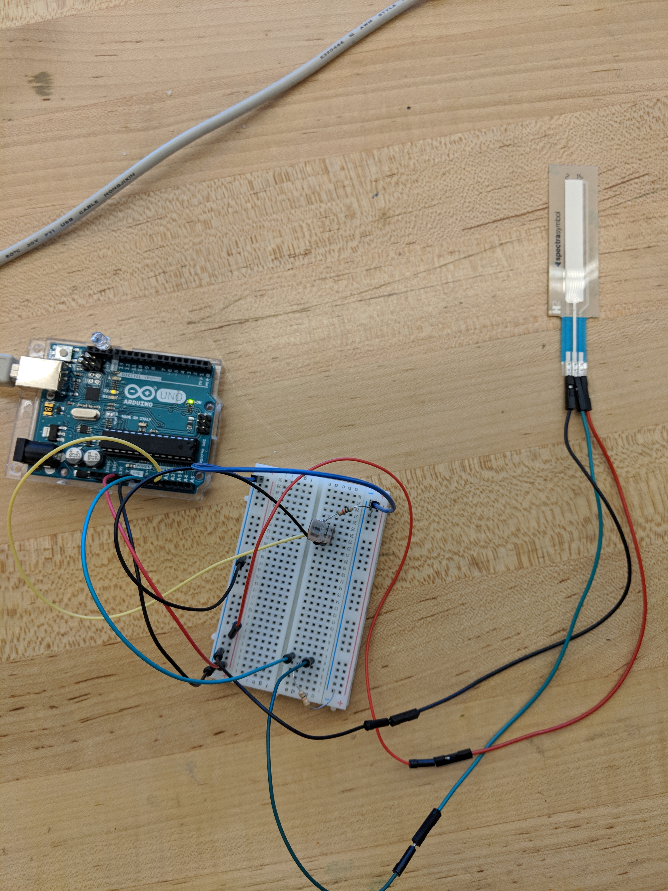
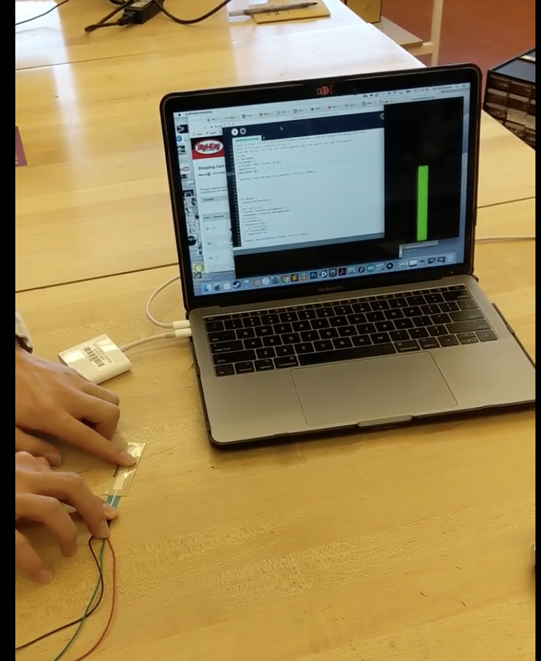

# ProcessingSoftPotSlider
written by Ziwei Liu and Zoe McCloskey
Make a slider out of a soft potentionmeter attached to PIN AO, Change the backgoround color
with a flex senors attached to pin A1
Use 10K resistor for the soft potentiometer and a 5K resitor for the flex sensor as pull down resistors.
Put the Standard Firmata on Adruino

